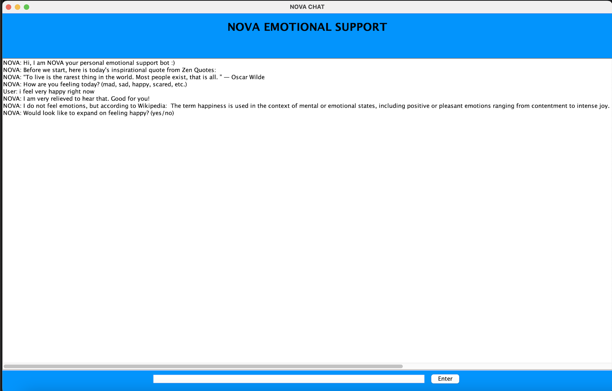

# COSC 310 Individual Assignment
Jan-Yaeger Dhillon

<!--  PROJECT TITLE -->

<h3 align="center">NOVA-ChatBot</h3>
  
Your Personal Emotional Support Bot

<!--  TABLE OF CONTENTS -->

  
Table of Contents

  <ol>
    <li>
      <a href="#about-the-project">About The Project</a>
      <ul>
        <li><a href="#built-with">Built With</a></li>
        <li><a href="#user-requirements">User Requirements</a></li>
        <li><a href="#system-requirements">System Requirements Specifications</a></li>
      </ul>
    </li>
    <li>
      <a href="#Installation Guide">Installation Guide</a>
    </li>
    <li>
      <a href="#New Features (A3)">New Features (A3)</a>
    </li>
    <li>
    <a href="#New APIs used (Individual Assignment)">New APIs used (Individual Assignment)</a>
    <li><a href="#license">License</a></li>
  </ol>

<!-- ABOUT THE PROJECT -->
## About The Project

The NOVA chatbot is an emotional support agent that helps the user deal with the emotions they are feeling to give them support and provide them with options to  help them feel better and maintain their mental health. 

(<a href="#top">back to top</a>)

### Built With

* [Java](https://www.java.com/en/)
* [Stanford POS Tagger Toolkit](https://nlp.stanford.edu/software/tagger.shtml)
* [RiTa API for WordNet](https://rednoise.org/rita/)
* [WordNet Toolkit](https://wordnet.princeton.edu/)
* [Stanford Sentiment Analysis Toolkit](https://nlp.stanford.edu/sentiment/)
* [JWiki Wikipedia API](https://github.com/viralvaghela/Jwiki)
* [ZenQuotes.io API](https://zenquotes.io)
* [JSoup Java HTML Parser](https://jsoup.org)

(<a href="#top">back to top</a>)

### User Requirements

Nova-ChatBot is able to hold a conversation of over 30 dialogues in order to talk through the user's emotion and help them feel better, while giving them helpful options to improve their mental heatlh. Lastly Nova-ChatBot will conclude the conversation and ask for a rating on how well it performed. 

(<a href="#top">back to top</a>)

### System Requirements Specifications

1. NOVA matches keywords from user input with its internal architecture to provide accurate responses to the input. 
2. Keywords and Responses are pulled from .txt files. 
3. Synonyms for programmed emotions are cross-referenced with the text files to check if the input contains an emotion.
4. NOVA is able to detect user emotions (Angry, Happy, Sad, Scared).
5. NOVA has various responses 
6. NOVA System is robust for future implementations. 

(<a href="#top">back to top</a>)

<!-- INSTALLATION GUIDE -->

## Installation Guide

To get a local copy up and running on your local device. You must have the Java Development Kit installed. Due to the size limit on GitHub, I was unable to upload a certain jar and the exectuable JAR file for NOVA. Here is the link to a zip folder of the completed project, which contains the runnable JAR and the necessary JARS for the toolkits to make the program run: 

[Project Zip](https://drive.google.com/file/d/1S4_HC_R2weywpceMh--Sopgen1ce32ES/view?usp=sharing)

(<a href="#top">back to top</a>)

To get the program running on your own computer, download the zip file, unzip it, create a new Java project (in Eclipse), and then import the downloaded unzipped folder into the project. Alternatively, run the NOVA.jar file.

<!-- NEW FEATURES (A3) -->

## New Features (A3)

We have added a new emotion for the user to talk to NOVA about: fear. This encapsulates anxiety and if the user is feeling scared about something. Fear is one of the 6 primary emotions felt by people so we think it is a good addition to our agent's repitoire. 

In addtion, we have split the canned responses of NOVA into intial and followup responses for each emotion. This gives a more authentic feel to the conversation and makes the responses seem more in line with when the user initially says what emotion they're feeling and then when they expand on it.

Furthermore, the use of the WordNet toolkit (through RiTa API) generates the synonyms for the emotions, and these are cross-referenced with the preset text files to see if the user has said an emotion using a synonym or similar word to simply mad, happy, sad, or fear. Note how "afraid" is not in the fear.txt but still works due to the synonym checker.

We implemented a Sentiment Analysis Toolkit from Stanford that checks if the user's feedback is positive, negative, or neutral based on a sentence. Initially, we used a number rating but the use of this toolkit allows for a more genuine review of our program and makes the bot feel more intelligent. 

We also used another toolkit from Stanford, a POS Tagger, that extracts the adjective from the user input, and this is used to check the adjective for an emotion. Thsi increases the efficiency of the program by using a prebuilt library and then we only have to check the adjective for an emotion.

In addition, we have planned for 5 unexpected topics the user may wish to talk about that our program is not ready to handle. These are if the user says they are feeling depressed, suicidal, bipolar, physically ill, or disgusted. These topics all have a predetermined response and will prompt the user to say something within the scope of the program. Checking for these topics improves our program because it is reasonable to believe that the user may respond to the bot's prompt of "How are you feeling?" with one of these topics, so it is important to plan for them and ask them to try again. 

Finally, we have implemented a GUI for the program using JSwing. This is a much needed addition to the program because it gives the chat a more visual appearance. The blue color for the chatbox was chosen to soothe the user while talking with the bot. This is a big improvement to the original project as it looks and feels more like an actual chat is going on. 

<!-- NEW APIs USED (INDIVIDUAL ASSIGNMENT) -->

## New APIs Used (Individual Assignment)

This iteration of the program implements new APIs to improve the conversation. 

The Wikipedia API, Jwiki, gets the definition of the emotion the user is detected as feeling and it is displayed. This makes the bot seems like it has a better understanding of emotions given that it has access to a large database of information on emotions. For example, the bot will read the emotion the user is feeling and then say what the Wikipedia definition is. Note that the definition extends beyond what is shown in the demo (the user can scroll within the GUI). Accessing Wikipedia gives more authenticity to what the bot is saying and adds on to the chatbot theme (as an AI). 

The JSoup API is also used to access and parse HTML, meaning it can access webpages and add relevant content into the bot conversation. It is used to access another API, the Zen Quotes API, which has a database of inspirational quotes. This helps motivate the user and adds more flavour to the converstaion. Together, these APIs are used to give the conversation more character and hopefully make the user feel better. ZenQuotes.io has a daily inspirational quote which is shown at the beginning of the program to set things off positive, and a random inspirational quote is shown after the user is done talking about their emotions. 

<!-- LICENSE -->

## License

MIT License 

(<a href="#top">back to top</a>)

